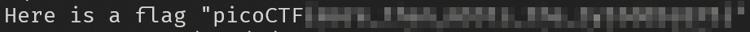
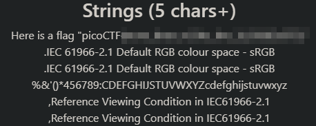

# Glory of the Garden

This problem is related to [stenography](https://en.wikipedia.org/wiki/Steganography), this is a practice where the information included on the media is not evident to the spectactor. 

In this challenge we are the spectators, and this beautiful image of a garden is the media. It contains our flag and we need to find it inside of the file.

We can use a hex editor, or a hex reader, also we can go to an online tool to analyze the image.

1. Using a strings reader

On a Gnu/Linux system there is a program called [strings](https://linux.die.net/man/1/strings). It is a Unix application that enables us to read text inside a binary file. 

`strings garden.jpg`

Give us the flag:

2. Using an online steganography tool:

This time we will use the [StegOnline](https://georgeom.net/StegOnline/image) tool. It has a small set of features, but they are the common tools on this kind of analysis.

The file is uploaded, and after that we search the button `Show Strings`. And look after our precious flag on them.

While this exercise is to start a journey on this topic, it has a place on the real-world security, where adversaries do their best to, as they said: "Put the data, hidden in plainsight".
