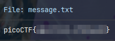

# Commitment Issues

A zip file is provided to us, when uncompressed, we find a directory named **drop-in**, but, what are we looking for?

The directory (common, you can call it folder if you wish, you won't be judged here) is a git project. Contains a file named **message.txt** and the respective **.git** directory.

We know can return to the problem statement:

> I accidentally wrote the flag down. Good thing I deleted it!

Then, the flag is still on the branch where the deletion occurred. Also, the actual content of the **message.txt** file is:

```bash
TOP SECRET
```
 
Going inside the **drop-in** directory and using the command:

`git status`

We know the name of the active branch, **master**.

Now, using other important git command, we know more about the deletion of the flag:

```bash
commit ef0b7cc6b98367fa168573c931e0f7098ef59182 (HEAD -> master)
Author: picoCTF <ops@picoctf.com>
Date:   Tue Mar 12 00:06:20 2024 +0000

    remove sensitive info

commit ea859bf3b5d94ee74ce5ee1afa3edd7d4d6b35f0
Author: picoCTF <ops@picoctf.com>
Date:   Tue Mar 12 00:06:20 2024 +0000

    create flag
```

When, who, and the most important clue, where. The commit **ea859bf3b5d94ee74ce5ee1afa3edd7d4d6b35f0**.

Let's check it out (Yes, pun intended!).

`git checkout ea859bf3b5d94ee74ce5ee1afa3edd7d4d6b35f0`

```bash
Note: switching to 'ea859bf3b5d94ee74ce5ee1afa3edd7d4d6b35f0'.

You are in 'detached HEAD' state. You can look around, make experimental
changes and commit them, and you can discard any commits you make in this
state without impacting any branches by switching back to a branch.

If you want to create a new branch to retain commits you create, you may
do so (now or later) by using -c with the switch command. Example:

  git switch -c <new-branch-name>

Or undo this operation with:

  git switch -

Turn off this advice by setting config variable advice.detachedHead to false

HEAD is now at ea859bf create flag
```

Now, reading again the text file we got the flag.

