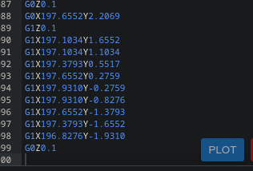
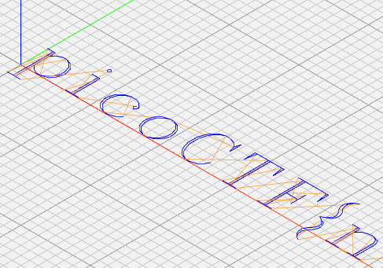

# Speeds and Feeds

We are asked to netcat this domain:

`mercury.picoctf.net 28067`

With the following command, the stdout is saved in a text file for working with it.

`nc mercury.picoctf.net 28067 > speeds.txt`

Looking a small portion of the the file we can see Gs, everywhere, followed by numbers and X, Y and Z. That make me think in 3D coordinates.

```G17 G21 G40 G90 G64 P0.003 F50
G0Z0.1
G0Z0.1
G0X0.8276Y3.8621
G1Z0.1
G1X0.8276Y-1.9310
```

Luckily, there is a hint, and tells us to look after the language that a CNC machine uses.

Using a browser I found that there are 4 software format used for precise machining:

* STEP 
* IGES
* G-code
* DXF

So many Gs, which one could it be?

Again, browsing for a website that is able to read the format I found:

[NC Viewer](https://ncviewer.com)

I clicked in the New File button, pasted the content of the saved file and click the PLOT button (Or just replace the existing  code with the content of the file, efficiency my friend).



And our flag appears, ready to be machined!

