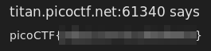

After running this instance, is possible to enter to a webpage:

[titan](http://titan.picoctf.net:61340/)

This webpage contains a bookmarklet already written for you to try:

```javascript
        javascript:(function() {
            var encryptedFlag = "àÒÆަȬëÙ£Ö�ÓÚåÛÑ¢ÕÓ�ÒËɧ�©�í";
            var key = "picoctf";
            var decryptedFlag = "";
            for (var i = 0; i < encryptedFlag.length; i++) {
                decryptedFlag += String.fromCharCode((encryptedFlag.charCodeAt(i) - key.charCodeAt(i % key.length) + 256) % 256);
            }
            alert(decryptedFlag);
        })();
```

I chose to open such code on the Developer Tools' console. Ctrl + I works for chrome and firefox. Remember that you can't paste that code without warning until you write "allow pasting".

Once you write that, paste and evaluate the code it results in the flag:


