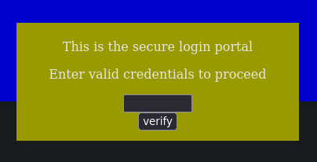
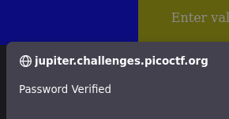

# Don't use client side

The challenge try to make you break into a "super secure portal", which is here:

`https://jupiter.challenges.picoctf.org/problem/17682/`



If we look after the Javascript in the page we have a file `md5.js` and this code:

```javascript
function verify() {
    checkpass = document.getElementById("pass").value;
    split = 4;
    if (checkpass.substring(0, split) == 'pico') {
      if (checkpass.substring(split*6, split*7) == '706c') {
        if (checkpass.substring(split, split*2) == 'CTF{') {
         if (checkpass.substring(split*4, split*5) == 'ts_p') {
          if (checkpass.substring(split*3, split*4) == 'lien') {
            if (checkpass.substring(split*5, split*6) == 'lz_b') {
              if (checkpass.substring(split*2, split*3) == 'no_c') {
                if (checkpass.substring(split*7, split*8) == '5}') {
                  alert("Password Verified")
                  }
                }
              }
      
            }
          }
        }
      }
    }
    else {
      alert("Incorrect password");
    }
  }
```

If we try to understand this code, we se nested conditions, this conditions compare substrings entered in the textbox with key pass. If the password entered complies to this conditions, then the alert pop-ups and give us the flag. Let's try:

* A variable split with value 4 is multiplied in the if statements, which means that the password is split based on the order of the multiples:

* From 0 (first character of the password) to the first split (fourth character):
    `pico`
* Then we search for `split, split2` with the characters comprised from 5th to the 8th character:
    `CTF`
* We do the same for the subsequent conditions:

|       Splits       | Characters |
| :----------------: | :--------: |
|     (0, split)     |    pico    |
|  (split, split*2)  |    CTF{    |
| (split*2, split*3) |    no_c    |
| (split*3, split*4) |    lien    |
| (split*4, split*5) |    ts_p    |
| (split*5, split*6) |    lz_b    |
| (split*6, split*7) |    706c    |
| (split*7, split*8) |     5}     |


Usually I don't share the flag, but this time since you read this walktrough, common, it's a must:

`picoCTF{no_clients_plz_b706c5}`

It works!

