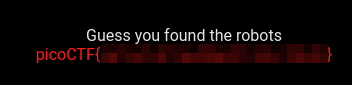

# Where are the robots

This challenge requires you to seek the robots.txt file. This file is a configuration file that tells crawlers and robots certain settings to interact with the website. 

Usually this file is on the top-level of the website, that is to say, at the same level of the index page. For example **index.html**.

The link is: 

`https://jupiter.challenges.picoctf.org/problem/56830/`

Then we go to:

`https://jupiter.challenges.picoctf.org/problem/56830/robots.txt`

The content of this file is:

```bash
User-agent: *
Disallow: /1bb4c.html
```

This file ask the crawlers to avoid listing this specific file, maybe because it contains something interesting.

`https://jupiter.challenges.picoctf.org/problem/56830/1bb4c.html`

And so it is! This webpage contains the flag.


